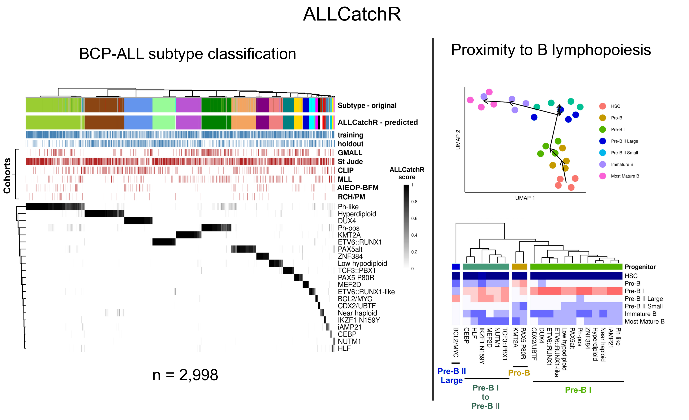
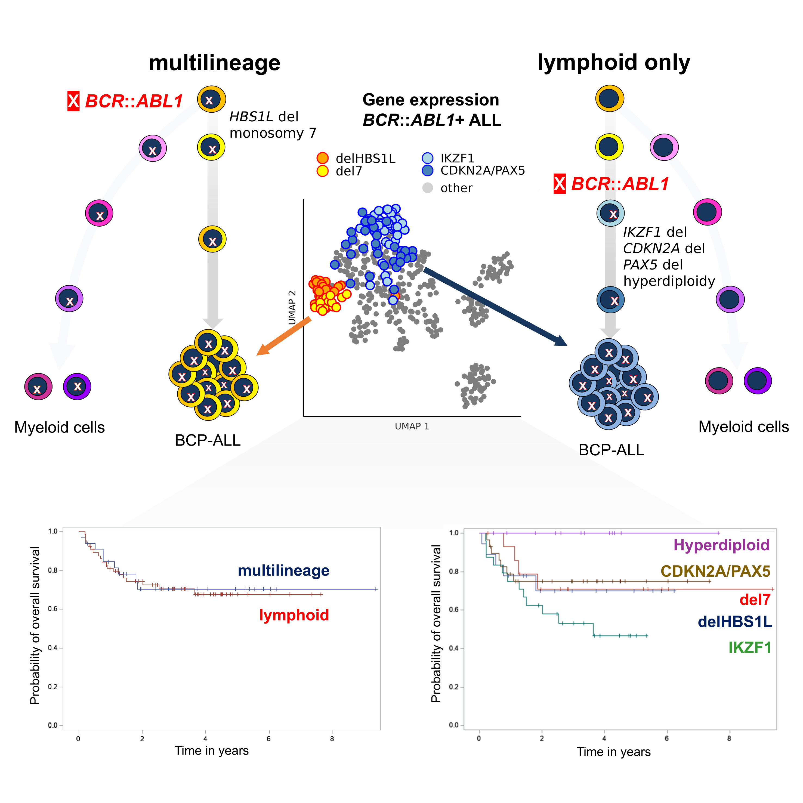

# ALLCatchRbcrabl1

_This is an update of the gene expression based BCP-ALL subtype classifier **ALLCatchR** (https://github.com/ThomasBeder/ALLCatchR) including the sublcuster identification of Ph-pos (BCR::ABL1). ‘Multilineage’ vs. ‘lymphoid-only’ BCR::ABL1 involvement and distinct cooperating events determine gene expression in BCR::ABL1-positive ALL_

# links to References
_BCR::ABL1_ subcluster https://ash.confex.com/ash/2023/webprogram/Paper187315.html
ALLCatchR - https://journals.lww.com/hemasphere/fulltext/2023/09000/the_gene_expression_classifier_allcatchr.7.aspx


_ALLCatchRbcrabl1_ was developed to predict:
- 21 BCP-ALL molecular subtypes (_BCL2/MYC_, _CDX2/UBTF_, _CEBP_, _DUX4_, _ETV6::RUNX1_, _ETV6::RUNX1-like_, _HLF_, Hyperdiploid, iAMP21, _IKZF1 N159Y_, _KMT2A_, Low hypodiploid, _MEF2D_, Near haploid, _NUTM1_, _PAX5 P80R_, _PAX5alt_, _Ph-like_, _Ph-pos_, _TCF3::PBX1_, _ZNF384_)
- Two _BCR::ABL1_ main gene expression clusters (multilineage and lymphoid) and five subcluster enriched for genomic aberrations (delHBS1L, del7, IKZF1, CDKN2A/B and hyperdiploidy
- Associations to B lymphopoiesis stages based on gene set enrichment analyses 
- Blast Count percentage
- Immunophenotype
- Patient's sex





## Publications
Beder T, Hansen BT, Hartmann AM, et al. A The Gene Expression Classifier ALLCatchR Identifies B-cell Precursor ALL Subtypes and Underlying Developmental Trajectories Across Age _HemaSphere_.  7(9):p e939, September 2023. (https://doi.org/10.1097/HS9.0000000000000939)
Beder T, Hansen BT, Hartmann AM, et al. A Multi-Cohort Gene Expression Classifier (ALLCatchR) Identifies B-Precursor ALL Subtypes and Their Developmental Trajectories across Age Groups. _Blood_. 2022;140(Supplement 1):1053–1055. (https://doi.org/10.1182/blood-2022-163311)

## Installation
open RStudio
install devtools and follow the installion guide https://github.com/r-lib/devtools
```
if (!require("devtools", quietly = TRUE))
  install.packages("devtools")
```
install ALLCatchRbcrabl1 
```
devtools::install_github("ThomasBeder/ALLCatchR_bcrabl1")
```

## Quickstart
If Counts.file is left ```NA``` ten test samples are predicted
```
library(ALLCatchRbcrabl1)
allcatch_bcrabl1()
```

## Run ALLCatchRbcrabl1
As input ALLCatchRbcrabl1 requires a single text file in which the first column represent the genes and the other columns the count data for each sample
```
library(ALLCatchRbcrabl1)
allcatch_bcrabl1(Counts.file = NA, ID_class = "symbol", sep = "\t", out.file = "predictions.tsv")
# Counts.file: /path/to/your/count/data, if left empty a test
# ID_class: gene names can be either "symbol", "ensemble_ID" or	"entrez_ID"
# sep: seperator of the text file usually "\t", "," or ";"
# out.file: name of the output file
```

## output
ALLCatchR writes a ```out.file``` file to your current working directory (or the path defined by out.file parameter) with the following columns:
- sample: Sample ID
- Score: BCP-ALL subtype prediction score
- Prediction: Predicted subtype
- Confidence: Confidence of subtype predictions, **IMPORTANT** predictions of samples labeled as unclassified here should be considered unclassified
- BCR_ABL1_subcluster_pred: BCR::ABL1 subcluster predictions for samples predicted to be Ph-pos
- BCR_ABL1_subcluster_score: BCR::ABL1 subcluster probability scores for samples predicted to be Ph-pos
- BlastCounts: Predicted Blast Count percentage
- Sex: Patient's sex predition
- Score_sex: Sex prediciton probability
- Immuno: Immunophenotype prediction
- ScoreImmuno: Immunophenotype prediciton probability
- 12-18: Enrichment analysis results (singscore, https://github.com/DavisLaboratory/singscore) to gene sets defined for B-cell progenitors
- 19-39: SVM linear predictions for individual subtypes
- 40-61: Results from gene set based nearest neighbor analysis
- 62-68: BCR::ABL1 subcluster probability scores for each sample
